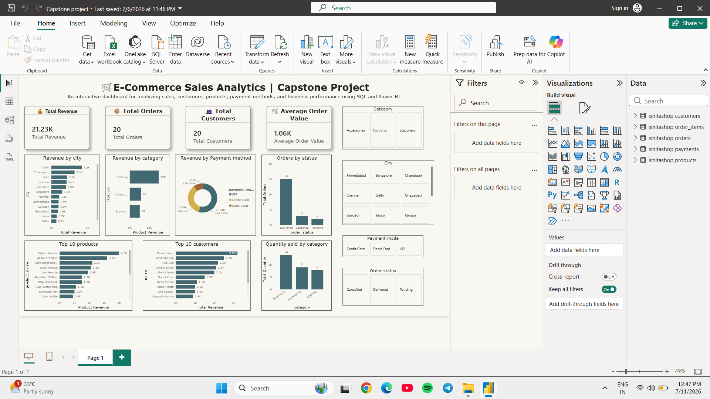

# 🛒 E-Commerce Sales Analytics| SQL & Power BI Capstone Project

## 📌 Project Overview

The E-Commerce Sales Analytics Dashboard is an end-to-end data analytics project developed using SQL and Power BI. The project analyzes sales performance, customer behavior, product trends, and payment methods to generate actionable business insights through an interactive dashboard.

This project demonstrates data modeling, SQL querying, DAX calculations, KPI creation, and dashboard design, making it suitable for business reporting and decision-making.

---

<h2>📊 Dashboard Preview</h2>

<p align="center">
  
</p>

---

## 🎯 Business Objectives

- Analyze overall sales performance.
- Track total revenue and customer orders.
- Identify top-performing products and categories.
- Understand customer purchasing behavior.
- Compare different payment methods.
- Monitor order status distribution.
- Provide interactive business insights through filters.

---

## 🛠️ Tools & Technologies

- Power BI
- SQL
- DAX
- Data Modeling
- Data Visualization

---

## 🗃️ Database Schema

The database contains the following relationships:

Customers (1) → Orders (*)

Orders (1) → Order Items (*)

Products (1) → Order Items (*)

Orders (1) → Payments (*)

---

## 📈 Key Performance Indicators (KPIs)

- Total Revenue
- Total Orders
- Total Customers
- Average Order Value

---

## 📊 Dashboard Features

- KPI Cards
- Revenue by Category
- Revenue by City
- Revenue by Payment Method
- Orders by Status
- Top 10 Products
- Top Customers
- Quantity Sold by Category
- Interactive Slicers

---

## 📋 DAX Measures

Some of the key DAX measures include:

- Total Revenue
- Total Orders
- Total Customers
- Average Order Value
- Product Revenue
- Total Quantity

---

## 💡 Business Insights

- Identified the highest revenue-generating product categories.
- Compared customer distribution across cities.
- Analyzed payment mode preferences.
- Evaluated order status performance.
- Identified top-performing products and customers.
- Enabled interactive filtering for detailed business analysis.

---

## 📁 Project Structure

```
E-Commerce-Sales-Analytics
│
├── Dashboard
│   └── E-Commerce-Sales-Analytics.pbix
│
├── SQL
│   ├── ecommerce_table_design.sql
│   └── ecommerce_queries.sql
│
├── Images
│   └── Dashboard.png
│
└── README.md
```

---

## 🚀 Key Skills Demonstrated

- SQL Queries
- Data Modeling
- Power BI Dashboard Development
- DAX Calculations
- KPI Design
- Interactive Reporting
- Business Intelligence
- Data Visualization

---

## 📌 Future Improvements

- Add time-series analysis with larger datasets.
- Include customer segmentation analysis.
- Create forecasting dashboards.
- Add drill-through pages and advanced tooltips.

---

## 👩‍💻 Author

**Ishita**

If you found this project useful, feel free to ⭐ the repository.
